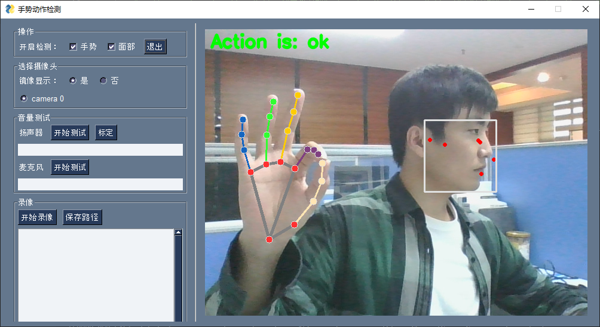
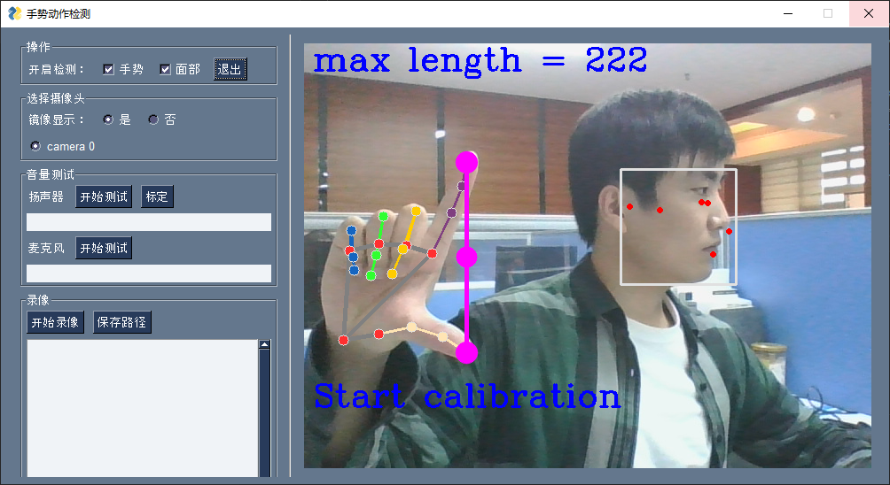
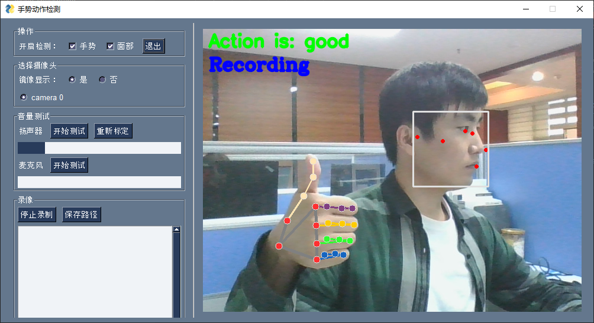

# 手势动作识别
使用tensorflow训练手势动作识别模型，手部数据使用mediapipe库获取，最后使用pysimplegui编写UI界面

环境:
- python: 3.7.16

依赖:
- meidapipe: 0.9.0.1
- opencv-contrib-python: 4.7.0.72
- tensorflow: 2.3.0

### 功能：
1. 手势动作识别：
目前能是识别十三种动作，分别是从1-10的手势表示，10用握拳表示，还有ok、good、not good
如果用户想添加自己手势，在 gesture.py 文件中可以自己收集数据，首先在 actions 列表中添加自己要收集的动作名，然后运行 collectData()函数。
就可以训练模型应用。代码很简单容易理解，用的tf高级函数接口。


2. 使用手势控制系统音量（使用拇指与食指指尖之间的距离）
首先需要标定：

然后点击开始测试按钮：


3. 视频录制


---
### 文件介绍：
- gesture.py: 收集手势动作数据、训练模型、评估
- CVideo.py: 用pysimplegui库写的简单桌面程序
- hand.py: 使用mediapipe库检测手部节点数据

### 打包
使用 pyinstaller 打包程序，具体命令见 run.sh 文件
如果在windows平台打包后打开后 报关于 matplotlib 库的错误，
解决方法是:
```bash
# 1. 卸载 matplotlib 库
pip uninstall matplotlib
# 2. 打开这个网站，下载和python版本对应的包 (我win上装的python3.8，所以下载：matplotlib-3.3.4-cp38-cp38-win_amd64.whl)
https://www.lfd.uci.edu/~gohlke/pythonlibs/#scipy
# 3. 用 pip 安装
pip install matplotlib-3.3.4-cp38-cp38-win_amd64.whl
```
如果还有其他问题，自己百度吧，pyinstaller在win平台的坑太多了

ubuntu上打包没遇到什么问题，就是pysimplegui在linux上对中文支持的不太好，中文字体太难看，所以截图使用了win上软件运行的截图

